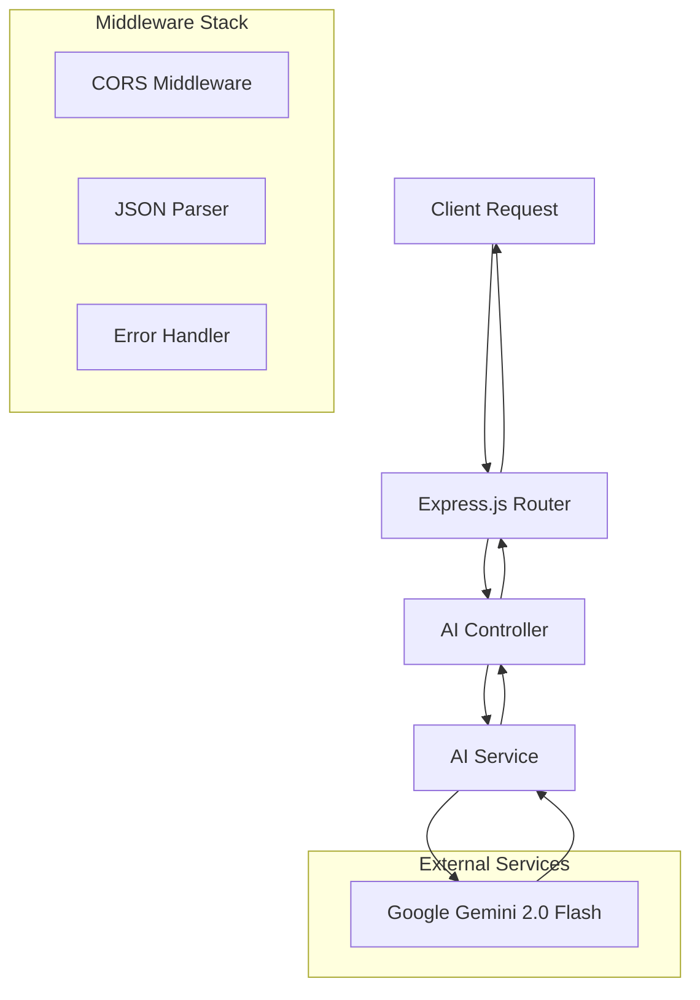

# 🚀 Backend API - Refactora AI

<div align="center">


**🤖 AI-Powered Code Review Backend Service**

</div>

---

## 📖 Table of Contents

- [🏗️ Architecture Overview](#️-architecture-overview)
- [🚀 Quick Start](#-quick-start)
- [📡 API Documentation](#-api-documentation)
- [🔧 Configuration](#-configuration)
- [🛠️ Tech Stack](#️-tech-stack)
- [📁 Project Structure](#-project-structure)
- [🔒 Security](#-security)
- [🧪 Testing](#-testing)
- [📊 Monitoring](#-monitoring)

---

## 🏗️ Architecture Overview

### 🎯 **Service Architecture**



### 🔄 **Request Flow**

1. **🌐 Client Request** → CORS validation
2. **🛠️ Middleware** → JSON parsing & validation
3. **🎯 Controller** → Request handling & validation
4. **⚙️ Service Layer** → Business logic processing
5. **🤖 AI Integration** → Google Gemini API call
6. **📤 Response** → Formatted AI review response

---

## 🚀 Quick Start

### 📋 Prerequisites
- **Node.js** v18+ 
- **npm** or **yarn**
- **Google Gemini API Key**

### ⚡ Installation

```bash
# Navigate to backend directory
cd BackEnd

# Install dependencies
npm install

# Create environment file
cp .env.example .env

# Add your API key to .env
echo "GOOGLE_GEMINI_KEY=your_api_key_here" >> .env
echo "PORT=5000" >> .env

# Start development server
npm run dev
```

🎉 **Backend running at**: [http://localhost:5000](http://localhost:5000)

---

## 📡 API Documentation

### 🔗 **Base URL**
```
http://localhost:5000
```

### 📋 **Endpoints**

#### 🏠 **Health Check**
```http
GET /
```

**Response:**
```json
{
  "message": "Hello World"
}
```

#### 🤖 **Code Review**
```http
POST /ai/get-review
```

**Request Body:**
```json
{
  "code": "function example() { console.log('Hello World'); }"
}
```

**Response:**
```markdown
## ✅ 1. Correctness 📝
The code is syntactically correct and will execute without errors...

## 📊 2. Time and Space Complexity ⏳💾
- **Time Complexity**: O(1) - Constant time operation...

[... detailed AI review continues ...]
```

### 📝 **Request/Response Examples**

<details>
<summary>🔍 <strong>Detailed API Examples</strong></summary>

#### **Example 1: JavaScript Function Review**

**Request:**
```bash
curl -X POST http://localhost:5000/ai/get-review \
  -H "Content-Type: application/json" \
  -d '{
    "code": "function factorial(n) {\n  if (n <= 1) return 1;\n  return n * factorial(n - 1);\n}"
  }'
```

**Response:**
```markdown
## ✅ 1. Correctness 📝
The factorial function is correctly implemented using recursion...

## 📊 2. Time and Space Complexity ⏳💾
- **Time Complexity**: O(n) - Linear time due to n recursive calls
- **Space Complexity**: O(n) - Call stack depth grows with input

## 🎨 3. Code Structure, Style, and Readability ✨
The code is clean and readable. Consider adding:
- Input validation for negative numbers
- JSDoc comments for better documentation

[... continues with full review ...]
```

#### **Example 2: Error Handling**

**Request with missing code:**
```json
{
  "code": ""
}
```

**Response:**
```
HTTP 400 Bad Request
"Code is required"
```

</details>

---

## 🔧 Configuration

### 🔑 **Environment Variables**

| Variable | Description | Required | Default |
|----------|-------------|----------|---------|
| `GOOGLE_GEMINI_KEY` | Google Gemini AI API Key | ✅ Yes | - |
| `PORT` | Server port number | ❌ No | 5000 |
| `NODE_ENV` | Environment mode | ❌ No | development |

### ⚙️ **Environment Setup**

```env
# .env file
GOOGLE_GEMINI_KEY=your_google_gemini_api_key
PORT=5000
NODE_ENV=development
```

### 🔧 **Google Gemini Configuration**

```javascript
// src/services/ai.service.js
const genAI = new GoogleGenerativeAI(process.env.GOOGLE_GEMINI_KEY);
const model = genAI.getGenerativeModel({
    model: "gemini-2.0-flash",
    systemInstruction: "Detailed code review prompt..."
});
```

---

## 🛠️ Tech Stack

### 🏗️ **Core Technologies**

| Technology | Version | Purpose | Documentation |
|------------|---------|---------|---------------|
| **Node.js** | v18+ | Runtime Environment | [📚 Docs](https://nodejs.org/) |
| **Express.js** | 4.21.2 | Web Framework | [📚 Docs](https://expressjs.com/) |
| **Google Generative AI** | 0.21.0 | AI Integration | [📚 Docs](https://ai.google.dev/) |

### 📦 **Dependencies**

```json
{
  "dependencies": {
    "@google/generative-ai": "^0.21.0",
    "cors": "^2.8.5",
    "dotenv": "^16.4.7",
    "express": "^4.21.2"
  },
  "devDependencies": {
    "nodemon": "^3.1.10"
  }
}
```

---

## 📁 Project Structure

```
📁 BackEnd/
├── 📁 src/
│   ├── 📁 controllers/
│   │   └── 📄 ai.controller.js     # Request handling & validation
│   ├── 📁 routes/
│   │   └── 📄 ai.routes.js         # API route definitions
│   ├── 📁 services/
│   │   └── 📄 ai.service.js        # Business logic & AI integration
│   └── 📄 app.js                   # Express app configuration
├── 📄 server.js                    # Server entry point
├── 📄 package.json                 # Dependencies & scripts
├── 📄 .env                         # Environment variables
├── 📄 .env.example                 # Environment template
└── 📄 README.md                    # This documentation
```

### 🏗️ **Layer Architecture**

#### 🎯 **1. Controller Layer** (`controllers/`)
- **Purpose**: Handle HTTP requests and responses
- **Responsibilities**:
  - Request validation
  - Response formatting
  - Error handling

```javascript
// ai.controller.js
async function getReview(req, res) {
    const code = req.body.code;
    
    if (!code) {
        return res.status(400).send("Code is required");
    }
    
    const response = await generateContent(code);
    res.send(response);
}
```

#### 🛤️ **2. Routes Layer** (`routes/`)
- **Purpose**: Define API endpoints
- **Responsibilities**:
  - URL routing
  - Middleware attachment

```javascript
// ai.routes.js
const router = express.Router();
router.post("/get-review", getReview);
```

#### ⚙️ **3. Service Layer** (`services/`)
- **Purpose**: Business logic and external integrations
- **Responsibilities**:
  - Google Gemini AI integration
  - Code analysis logic
  - Response processing

---

## 🔒 Security

### 🛡️ **Security Measures**

1. **🔑 API Key Protection**
   - Environment variables for sensitive data
   - No API keys in source code

2. **🌐 CORS Configuration**
   - Controlled cross-origin access
   - Frontend domain whitelisting

3. **✅ Input Validation**
   - Request body validation
   - Code content filtering

4. **🚫 Non-Code Request Filtering**
   - Prevents misuse of AI service
   - Professional code review focus

### 🔧 **Security Best Practices**

```javascript
// Input validation example
const nonCodeKeywords = [
    'what is', 'how to', 'explain', 'tell me'
];

const lowerInput = code.toLowerCase();
if (nonCodeKeywords.some(keyword => lowerInput.includes(keyword))) {
    return "I only review code. Please provide programming code for analysis.";
}
```

---

## 🧪 Testing

### 🔬 **Testing Strategy**

```bash
# Unit tests
npm run test

# Integration tests
npm run test:integration

# API tests with curl
curl -X POST http://localhost:5000/ai/get-review \
  -H "Content-Type: application/json" \
  -d '{"code": "console.log(\"test\");"}'
```

### 📊 **Test Coverage Areas**

- ✅ API endpoint functionality
- ✅ Request validation
- ✅ Error handling
- ✅ AI service integration
- ✅ Response formatting

---

## 📊 Monitoring

### 📈 **Performance Monitoring**

```javascript
// Request logging
app.use((req, res, next) => {
    console.log(`${req.method} ${req.path} - ${new Date().toISOString()}`);
    next();
});
```

### 🔍 **Health Checks**

- **Endpoint**: `GET /`
- **Purpose**: Service availability verification
- **Response**: Simple "Hello World" message

### 📝 **Logging**

```javascript
// Request timestamp logging
console.log(`Request received at ${new Date()}`);
```

---

## 🚀 Development

### 🛠️ **Available Scripts**

```bash
# Development with auto-reload
npm run dev

# Production start
npm start

# Install dependencies
npm install
```

### 🔧 **Development Workflow**

1. **🔄 Start nodemon**: `npm run dev`
2. **🧪 Test endpoints**: Use Postman or curl
3. **🐛 Debug**: Check console logs
4. **🔄 Hot reload**: Automatic on file changes

---

## 🤝 Contributing

### 📋 **Backend Contribution Guidelines**

1. **🏗️ Architecture**: Follow layered architecture pattern
2. **📝 Code Style**: Use consistent formatting and naming
3. **🧪 Testing**: Add tests for new features
4. **📚 Documentation**: Update README for API changes

### 🔄 **Pull Request Process**

1. Create feature branch from `main`
2. Implement changes with tests
3. Update documentation
4. Submit PR with detailed description

---

<div align="center">

### 🎯 **API Ready for Production**

**Scalable • Secure • Well-Documented**

[🔙 Back to Main README](../README.md) | [🐛 Report Issues](https://github.com/saksham-1304/AI-Code-Reviewer/issues)

</div>
