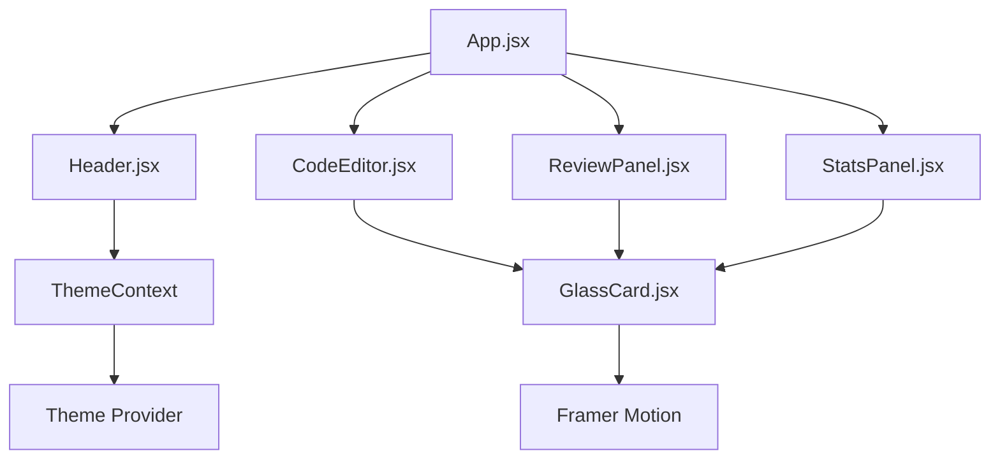

# 🎨 Frontend - Refactora AI

<div align="center">


**✨ Modern React Frontend with Glass Morphism Design**

</div>

---

## 📖 Table of Contents

- [🎨 Design System](#-design-system)
- [🏗️ Component Architecture](#️-component-architecture)
- [🚀 Quick Start](#-quick-start)
- [⚙️ Configuration](#️-configuration)
- [🎭 Theming System](#-theming-system)
- [📱 Responsive Design](#-responsive-design)
- [🎬 Animations](#-animations)
- [🛠️ Tech Stack](#️-tech-stack)
- [📂 Project Structure](#-project-structure)
- [🎯 Performance](#-performance)
- [🧪 Testing](#-testing)

---

## 🎨 Design System

### 🌟 **Visual Identity**

Our design system embraces **Glass Morphism** - a modern design trend featuring:

- **🔮 Translucent Background**: Backdrop blur effects
- **✨ Subtle Borders**: Semi-transparent borders
- **🎨 Gradient Overlays**: Beautiful color transitions
- **💫 Smooth Animations**: Framer Motion powered interactions

### 🎨 **Color Palette**

#### 🌙 **Dark Theme**
```css
/* Primary Colors */
--bg-primary: linear-gradient(135deg, #0f172a 0%, #581c87 50%, #0f172a 100%)
--glass-bg: rgba(255, 255, 255, 0.05)
--glass-border: rgba(255, 255, 255, 0.1)
--text-primary: #ffffff
--text-secondary: #e5e7eb
--accent: #8b5cf6
```

#### ☀️ **Light Theme**
```css
/* Primary Colors */
--bg-primary: linear-gradient(135deg, #f9fafb 0%, #dbeafe 50%, #f9fafb 100%)
--glass-bg: rgba(0, 0, 0, 0.05)
--glass-border: rgba(0, 0, 0, 0.1)
--text-primary: #111827
--text-secondary: #374151
--accent: #8b5cf6
```

### 🔤 **Typography**

```css
/* Font Stack */
font-family: 'Inter', system-ui, -apple-system, sans-serif;  /* UI Text */
font-family: 'Fira Code', 'JetBrains Mono', monospace;       /* Code */
```

---

## 🏗️ Component Architecture

### 🧩 **Component Hierarchy**



### 📋 **Component Documentation**

#### 🎯 **Core Components**

<details>
<summary>📝 <strong>App.jsx</strong> - Main Application Component</summary>

**Purpose**: Root component managing application state and layout

**Key Features**:
- 📊 Stats management with localStorage persistence
- 🔄 API integration with backend
- 🎨 Responsive grid layout
- 🌈 Animated background gradients

**State Management**:
```javascript
const [content, setContent] = useState('');      // Code editor content
const [review, setReview] = useState('');        // AI review response
const [isLoading, setIsLoading] = useState(false); // Loading state
const [stats, setStats] = useState({});          // User statistics
```

</details>

<details>
<summary>🎨 <strong>Header.jsx</strong> - Navigation & Branding</summary>

**Purpose**: Top navigation with branding and user controls

**Features**:
- 🌟 Animated logo with gradient text
- 🌙 Theme toggle button
- 👑 Pro badge display
- 🔗 GitHub link
- 📱 Responsive design

**Animations**:
- Entrance animation with stagger
- Hover effects on interactive elements
- Smooth theme transition

</details>

<details>
<summary>📊 <strong>StatsPanel.jsx</strong> - Analytics Dashboard</summary>

**Purpose**: Display user statistics and metrics

**Metrics Displayed**:
- 📈 Total reviews count
- ⏱️ Average review time
- 🔍 Issues found
- ✨ Improvements suggested

**Design**:
- Glass morphism cards
- Color-coded icons
- Responsive grid layout
- Staggered entrance animations

</details>

<details>
<summary>💻 <strong>CodeEditor.jsx</strong> - Professional Code Editor</summary>

**Purpose**: Feature-rich code editing experience

**Key Features**:
- 🎨 Syntax highlighting (Prism.js)
- 🔤 Multiple language support
- 📁 File upload/download
- 📋 Copy to clipboard
- 🎯 Language selection dropdown

**Supported Languages**:
- JavaScript
- Python  
- Java
- C++
- TypeScript

**Editor Configuration**:
```javascript
style={{
  fontFamily: '"Fira Code", "JetBrains Mono", monospace',
  fontSize: 14,
  lineHeight: 1.6,
  backgroundColor: "transparent",
  caretColor: "#a855f7"
}}
```

</details>

<details>
<summary>📄 <strong>ReviewPanel.jsx</strong> - AI Review Display</summary>

**Purpose**: Display formatted AI code reviews

**Features**:
- 📖 Markdown rendering with syntax highlighting
- 🔄 Regenerate review option
- 💾 Download review as file
- 🔗 Share review functionality
- 🎨 Theme-aware prose styling

**Loading States**:
- Dual-ring spinner animation
- Progressive text reveal
- Smooth content transitions

</details>

<details>
<summary>🪟 <strong>GlassCard.jsx</strong> - Reusable Glass Component</summary>

**Purpose**: Consistent glass morphism container

**Features**:
- 🔮 Backdrop blur effects
- ✨ Semi-transparent backgrounds
- 🎨 Theme-aware styling
- 📱 Responsive design
- 🎬 Entrance animations

**CSS Implementation**:
```css
backdrop-filter: blur(16px) saturate(180%);
background-color: rgba(255, 255, 255, 0.05);
border: 1px solid rgba(255, 255, 255, 0.1);
```

</details>

---

## 🚀 Quick Start

### 📋 Prerequisites
- **Node.js** v18+
- **npm** or **yarn**

### ⚡ Installation

```bash
# Navigate to frontend directory
cd Frontend

# Install dependencies
npm install

# Start development server
npm run dev
```

🎉 **Frontend running at**: [http://localhost:5173](http://localhost:5173)

### 🔧 **Development Commands**

```bash
# Development server with HMR
npm run dev

# Production build
npm run build

# Preview production build
npm run preview

# Lint code
npm run lint
```

---

## ⚙️ Configuration

### 🔧 **Vite Configuration**

```javascript
// vite.config.js
export default defineConfig({
  plugins: [react()],
  css: {
    postcss: './postcss.config.js',
  },
  server: {
    port: 5173,
    host: true
  }
})
```

### 🎨 **Tailwind Configuration**

```javascript
// tailwind.config.js
export default {
  content: ["./index.html", "./src/**/*.{js,ts,jsx,tsx}"],
  darkMode: 'class',
  theme: {
    extend: {
      fontFamily: {
        'sans': ['Inter', 'system-ui', 'sans-serif'],
        'mono': ['Fira Code', 'JetBrains Mono', 'monospace'],
      },
      animation: {
        'gradient-x': 'gradient-x 15s ease infinite',
        'float': 'float 3s ease-in-out infinite',
      }
    }
  }
}
```

---

## 🎭 Theming System

### 🌙 **Theme Context**

```javascript
// contexts/ThemeContext.jsx
const ThemeContext = createContext();

export const ThemeProvider = ({ children }) => {
    const [isDark, setIsDark] = useState(true); // Default to dark
    
    useEffect(() => {
        // Sync with localStorage and system preference
        const savedTheme = localStorage.getItem('theme');
        if (savedTheme !== null) {
            setIsDark(savedTheme === 'dark');
        }
    }, []);
    
    const toggleTheme = () => setIsDark(prev => !prev);
    
    return (
        <ThemeContext.Provider value={{ isDark, toggleTheme }}>
            {children}
        </ThemeContext.Provider>
    );
};
```

### 🎨 **Theme Implementation**

#### **Component Level**
```javascript
const { isDark } = useTheme();

const dynamicClasses = `
  ${isDark 
    ? 'bg-white/5 border-white/10 text-white' 
    : 'bg-black/5 border-black/10 text-gray-900'
  }
`;
```

#### **CSS Level**
```css
/* index.css */
body.dark {
  background: linear-gradient(135deg, #0f172a 0%, #581c87 50%, #0f172a 100%);
}

body.light {
  background: linear-gradient(135deg, #f9fafb 0%, #dbeafe 50%, #f9fafb 100%);
}
```

---

## 📱 Responsive Design

### 📐 **Breakpoint System**

| Breakpoint | Width | Target Device |
|------------|-------|---------------|
| `sm` | 640px | Mobile |
| `md` | 768px | Tablet |
| `lg` | 1024px | Desktop |
| `xl` | 1280px | Large Desktop |

### 🎨 **Responsive Components**

```javascript
// Example: Responsive grid
<div className="grid grid-cols-1 lg:grid-cols-2 gap-6">
  <CodeEditor />
  <ReviewPanel />
</div>

// Example: Responsive stats
<div className="grid grid-cols-2 lg:grid-cols-4 gap-4">
  {statsItems.map(item => <StatCard key={item.id} {...item} />)}
</div>
```

### 📱 **Mobile Optimizations**

- **Touch-friendly buttons**: Minimum 44px tap targets
- **Readable typography**: Optimal font sizes for mobile
- **Scrollable containers**: Custom scrollbars with smooth scrolling
- **Responsive spacing**: Adaptive padding and margins

---

## 🎬 Animations

### ✨ **Framer Motion Integration**

```javascript
// Entrance animations
<motion.div
  initial={{ opacity: 0, y: 20 }}
  animate={{ opacity: 1, y: 0 }}
  transition={{ duration: 0.5 }}
>
  <ComponentContent />
</motion.div>

// Staggered animations
<motion.div
  initial={{ opacity: 0 }}
  animate={{ opacity: 1 }}
  transition={{ duration: 0.5, delay: index * 0.1 }}
>
  <StatsCard />
</motion.div>
```

### 🎨 **Custom CSS Animations**

```css
/* Loading spinner */
@keyframes spin {
  0% { transform: rotate(0deg); }
  100% { transform: rotate(360deg); }
}

/* Floating elements */
@keyframes float {
  0%, 100% { transform: translateY(0px); }
  50% { transform: translateY(-10px); }
}

/* Gradient animations */
@keyframes gradient-x {
  0%, 100% { transform: translateX(-50%); }
  50% { transform: translateX(50%); }
}
```

---

## 🛠️ Tech Stack

### 🏗️ **Core Technologies**

| Technology | Version | Purpose | Bundle Size |
|------------|---------|---------|-------------|
| **React** | 18.3.1 | UI Framework | ~45KB |
| **Vite** | 6.1.0 | Build Tool | Dev only |
| **Tailwind CSS** | 3.4.0 | Styling | ~10KB |
| **Framer Motion** | 11.0.0 | Animations | ~35KB |

### 📦 **Key Dependencies**

```json
{
  "dependencies": {
    "react": "^18.3.1",
    "react-dom": "^18.3.1",
    "framer-motion": "^11.0.0",
    "react-simple-code-editor": "^0.14.1",
    "react-markdown": "^9.0.3",
    "prismjs": "^1.29.0",
    "axios": "^1.7.9",
    "react-icons": "^5.0.1"
  }
}
```

---

## 📂 Project Structure

```
📁 Frontend/
├── 📁 public/
│   └── 🖼️ favicon & assets
├── 📁 src/
│   ├── 📁 components/
│   │   ├── 📄 App.jsx              # Main application
│   │   ├── 📄 Header.jsx           # Navigation header
│   │   ├── 📄 CodeEditor.jsx       # Code editing interface
│   │   ├── 📄 ReviewPanel.jsx      # AI review display
│   │   ├── 📄 StatsPanel.jsx       # Analytics dashboard
│   │   └── 📄 GlassCard.jsx        # Reusable glass container
│   ├── 📁 contexts/
│   │   └── 📄 ThemeContext.jsx     # Theme management
│   ├── 📄 main.jsx                 # React entry point
│   └── 📄 index.css                # Global styles
├── 📄 index.html                   # HTML template
├── 📄 package.json                 # Dependencies
├── 📄 vite.config.js              # Vite configuration
├── 📄 tailwind.config.js          # Tailwind configuration
├── 📄 postcss.config.js           # PostCSS configuration
└── 📄 README.md                    # This documentation
```

### 🏗️ **Architecture Patterns**

#### **📁 Component Organization**
- **Atomic Design**: Reusable components (GlassCard)
- **Feature-based**: Grouped by functionality
- **Context Separation**: Isolated state management

#### **📝 Code Style**
- **Functional Components**: React Hooks pattern
- **Custom Hooks**: Reusable logic (useTheme)
- **Prop Validation**: TypeScript-style prop handling

---

## 🎯 Performance

### ⚡ **Optimization Strategies**

#### **🔧 Build Optimizations**
- **Code Splitting**: Automatic route-based splitting
- **Tree Shaking**: Unused code elimination
- **Asset Optimization**: Image and font optimization

#### **🚀 Runtime Optimizations**
- **React.memo**: Prevent unnecessary re-renders
- **useCallback**: Optimize function references
- **useMemo**: Cache expensive calculations
- **Lazy Loading**: Dynamic imports for heavy components

### 📊 **Performance Metrics**

```bash
# Bundle analysis
npm run build
npx vite-bundle-analyzer dist

# Lighthouse scores target
Performance: 95+
Accessibility: 100
Best Practices: 100
SEO: 95+
```

### 🔧 **Performance Monitoring**

```javascript
// Component performance tracking
const trackRenderTime = (componentName) => {
  const startTime = performance.now();
  
  useEffect(() => {
    const endTime = performance.now();
    console.log(`${componentName} render time: ${endTime - startTime}ms`);
  });
};
```

---

## 🧪 Testing

### 🔬 **Testing Strategy**

```bash
# Unit tests
npm run test

# Component tests
npm run test:components

# E2E tests  
npm run test:e2e

# Visual regression tests
npm run test:visual
```

### 📋 **Test Coverage Areas**

- ✅ Component rendering
- ✅ User interactions
- ✅ Theme switching
- ✅ API integration
- ✅ Responsive design
- ✅ Accessibility compliance

### 🧪 **Testing Tools**

```json
{
  "devDependencies": {
    "@testing-library/react": "^13.4.0",
    "@testing-library/jest-dom": "^5.16.5",
    "@testing-library/user-event": "^14.4.3",
    "vitest": "^0.34.0"
  }
}
```

---

## 🎨 Styling Guide

### 🎭 **Component Styling Patterns**

#### **🔮 Glass Morphism Components**
```javascript
// Standard glass card
<div className="backdrop-blur-xl bg-white/5 border border-white/10 rounded-2xl">
  <Content />
</div>

// Interactive glass button
<button className="backdrop-blur-sm bg-white/5 border border-white/10 hover:bg-white/10 transition-colors">
  Click me
</button>
```

#### **🎨 Theme-Aware Styling**
```javascript
const { isDark } = useTheme();

const themeClasses = `
  transition-colors duration-300
  ${isDark 
    ? 'bg-white/5 border-white/10 text-white' 
    : 'bg-black/5 border-black/10 text-gray-900'
  }
`;
```

### 📱 **Responsive Utilities**

```javascript
// Responsive spacing
<div className="p-4 md:p-6 lg:p-8">

// Responsive typography  
<h1 className="text-lg md:text-xl lg:text-2xl">

// Responsive grid
<div className="grid grid-cols-1 md:grid-cols-2 lg:grid-cols-4">
```

---

## 🚀 Deployment

### 📦 **Build Process**

```bash
# Production build
npm run build

# Preview build locally
npm run preview

# Analyze bundle
npx vite-bundle-analyzer dist
```

### 🌐 **Deployment Platforms**

- **Vercel** (Recommended)
- **Netlify**
- **GitHub Pages**
- **AWS S3 + CloudFront**

### 🔧 **Environment Variables**

```bash
# .env.production
VITE_API_URL=https://your-backend-api.com
VITE_APP_VERSION=1.0.0
```

---

## 🤝 Contributing

### 📋 **Frontend Contribution Guidelines**

1. **🎨 Design**: Follow glass morphism design system
2. **♿ Accessibility**: Ensure WCAG 2.1 compliance
3. **📱 Responsive**: Test on multiple device sizes
4. **🎬 Animations**: Use Framer Motion for consistency
5. **🧪 Testing**: Add tests for new components

### 🔄 **Component Development Workflow**

1. **📝 Plan**: Design component API and props
2. **🎨 Build**: Implement with glass morphism styling
3. **🧪 Test**: Add unit and integration tests
4. **📚 Document**: Update README and Storybook
5. **🔍 Review**: Submit PR with screenshots

---

<div align="center">

### ✨ **Beautiful, Modern, Accessible**

**Glass Morphism • Dark/Light Theme • Responsive Design**

[🔙 Back to Main README](../README.md) | [🎨 Design System](https://www.figma.com/design-system) | [📱 Live Demo](https://ai-code-reviewer.vercel.app/)

</div>
