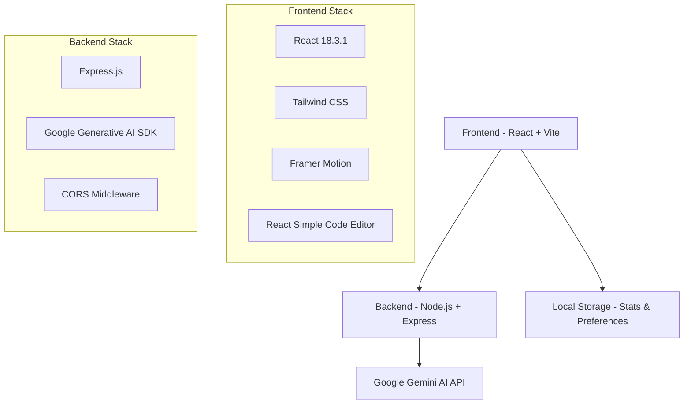

# 🤖 Refactora AI - Code Reviewer

<div align="center">


**🚀 AI-Powered Code Review Tool using Google Gemini AI**

[](https://reactjs.org/)
[](https://nodejs.org/)
[](https://ai.google.dev/)
[](https://tailwindcss.com/)

[🌟 Live Demo](https://ai-code-reviewer.vercel.app/) | [📚 Documentation](#-documentation) | [🚀 Quick Start](#-quick-start)

</div>

---

## 📖 Table of Contents

- [🌟 Features](#-features)
- [🎬 Demo](#-demo)
- [🏗️ Architecture](#️-architecture)
- [🚀 Quick Start](#-quick-start)
- [⚙️ Installation](#️-installation)
- [🔧 Configuration](#-configuration)
- [📱 Usage](#-usage)
- [🛠️ Tech Stack](#️-tech-stack)
- [📂 Project Structure](#-project-structure)
- [🤝 Contributing](#-contributing)
- [📄 License](#-license)

---

## 🌟 Features

### 🔍 **Intelligent Code Analysis**
- **Multi-language Support**: JavaScript, Python, Java, C++, TypeScript
- **Real-time Review**: Instant AI-powered code analysis
- **Comprehensive Feedback**: Detailed insights on code quality, bugs, and improvements

### 🎨 **Modern User Experience**
- **Dark/Light Theme**: Seamless theme switching with system preference detection
- **Responsive Design**: Perfect experience across desktop, tablet, and mobile
- **Glass Morphism UI**: Beautiful, modern interface with smooth animations
- **Code Syntax Highlighting**: Professional code editor with Prism.js integration

### 📊 **Analytics & Insights**
- **Review Statistics**: Track total reviews, average time, issues found
- **Performance Metrics**: Real-time analysis of code quality improvements
- **Export Options**: Download reviews in Markdown format

### 🚀 **Developer Features**
- **File Upload**: Import code files directly into the editor
- **Copy/Share**: Easy code and review sharing capabilities
- **Regenerate Reviews**: Get fresh perspectives on your code
- **Professional Editor**: Feature-rich code editor with line numbers and syntax highlighting

---

## 🎬 Demo

<div align="center">

### 🖥️ Desktop Experience
*Beautiful glass morphism design with professional code editor*

### 📱 Mobile Responsive
*Optimized for all devices with touch-friendly interface*

### 🌙 Theme Switching
*Seamless dark/light mode transition*

</div>

---

## 🏗️ Architecture



### 🔄 **Request Flow**
1. **User Input** → Code entered in editor
2. **Frontend** → Sends code to backend API
3. **Backend** → Processes request with Google Gemini
4. **AI Analysis** → Comprehensive code review generated
5. **Response** → Formatted review displayed to user

---

## 🚀 Quick Start

### 📋 Prerequisites
- **Node.js** (v18 or higher)
- **npm** or **yarn**
- **Google Gemini API Key** ([Get yours here](https://ai.google.dev/))

### ⚡ One-Click Setup

```bash
# Clone the repository
git clone https://github.com/saksham-1304/AI-Code-Reviewer.git
cd AI-Code-Reviewer

# Install dependencies for both frontend and backend
npm run install-all

# Set up environment variables
cp BackEnd/.env.example BackEnd/.env
# Add your GOOGLE_GEMINI_KEY to BackEnd/.env

# Start development servers
npm run dev
```

🎉 **That's it!** Your application will be running at:
- **Frontend**: [http://localhost:5173](http://localhost:5173)
- **Backend**: [http://localhost:5000](http://localhost:5000)

---

## ⚙️ Installation

### 🔧 Manual Setup

<details>
<summary>📦 <strong>Step-by-step Installation</strong></summary>

#### 1️⃣ Clone Repository
```bash
git clone https://github.com/saksham-1304/AI-Code-Reviewer.git
cd AI-Code-Reviewer
```

#### 2️⃣ Backend Setup
```bash
cd BackEnd
npm install
```

#### 3️⃣ Frontend Setup
```bash
cd ../Frontend
npm install
```

#### 4️⃣ Environment Configuration
```bash
# In BackEnd folder
cp .env.example .env
```

Edit `.env` file:
```env
GOOGLE_GEMINI_KEY=your_actual_api_key_here
PORT=5000
```

#### 5️⃣ Start Development Servers

**Using the batch script (Windows):**
```bash
# From project root
start-dev.bat
```

**Manual start:**
```bash
# Terminal 1 - Backend
cd BackEnd
npm run dev

# Terminal 2 - Frontend
cd Frontend
npm run dev
```

</details>

---

## 🔧 Configuration

### 🔑 **API Keys**
1. Visit [Google AI Studio](https://ai.google.dev/)
2. Create a new API key
3. Add to `BackEnd/.env`:
   ```env
   GOOGLE_GEMINI_KEY=your_api_key_here
   ```

### 🎛️ **Environment Variables**
| Variable | Description | Default |
|----------|-------------|---------|
| `GOOGLE_GEMINI_KEY` | Google Gemini AI API Key | Required |
| `PORT` | Backend server port | 5000 |

### ⚙️ **Frontend Configuration**
- **Theme**: Auto-detects system preference
- **Port**: 5173 (Vite default)
- **API Base URL**: `http://localhost:5000`

---

## 📱 Usage

### 🎯 **Getting Started**

1. **📝 Enter Code**: Paste or type your code in the editor
2. **🔍 Select Language**: Choose from JavaScript, Python, Java, C++, TypeScript
3. **🚀 Review**: Click "Review Code" button
4. **📊 Analyze**: Get comprehensive AI feedback
5. **📥 Export**: Download or share your review

### 💡 **Pro Tips**

- **🔄 Regenerate**: Get different perspectives by regenerating reviews
- **📁 File Upload**: Drag and drop code files directly
- **🎨 Theme Toggle**: Switch between dark/light modes anytime
- **📊 Track Progress**: View your coding improvement statistics

---

## 🛠️ Tech Stack

### 🎨 **Frontend**
| Technology | Version | Purpose |
|------------|---------|---------|
| **React** | 18.3.1 | UI Framework |
| **Vite** | 6.1.0 | Build Tool & Dev Server |
| **Tailwind CSS** | 3.4.0 | Styling Framework |
| **Framer Motion** | 11.0.0 | Animations |
| **React Simple Code Editor** | 0.14.1 | Code Editor |
| **Prism.js** | 1.29.0 | Syntax Highlighting |
| **React Markdown** | 9.0.3 | Markdown Rendering |
| **Axios** | 1.7.9 | HTTP Client |

### ⚙️ **Backend**
| Technology | Version | Purpose |
|------------|---------|---------|
| **Node.js** | - | Runtime Environment |
| **Express** | 4.21.2 | Web Framework |
| **Google Generative AI** | 0.21.0 | AI Integration |
| **CORS** | 2.8.5 | Cross-Origin Resource Sharing |
| **dotenv** | 16.4.7 | Environment Variables |

---

## 📂 Project Structure

```
📁 AI-Code-Reviewer/
├── 📁 BackEnd/
│   ├── 📁 src/
│   │   ├── 📁 controllers/
│   │   │   └── 📄 ai.controller.js
│   │   ├── 📁 routes/
│   │   │   └── 📄 ai.routes.js
│   │   ├── 📁 services/
│   │   │   └── 📄 ai.service.js
│   │   └── 📄 app.js
│   ├── 📄 server.js
│   ├── 📄 package.json
│   └── 📄 .env
├── 📁 Frontend/
│   ├── 📁 src/
│   │   ├── 📁 components/
│   │   │   ├── 📄 CodeEditor.jsx
│   │   │   ├── 📄 ReviewPanel.jsx
│   │   │   ├── 📄 Header.jsx
│   │   │   ├── 📄 StatsPanel.jsx
│   │   │   └── 📄 GlassCard.jsx
│   │   ├── 📁 contexts/
│   │   │   └── 📄 ThemeContext.jsx
│   │   ├── 📄 App.jsx
│   │   ├── 📄 main.jsx
│   │   └── 📄 index.css
│   ├── 📄 index.html
│   ├── 📄 package.json
│   ├── 📄 vite.config.js
│   └── 📄 tailwind.config.js
├── 📄 start-dev.bat
└── 📄 README.md
```

---

## 🤝 Contributing

We welcome contributions! Please see our contributing guidelines:

### 🚀 **Quick Contribution Steps**

1. **🍴 Fork** the repository
2. **🌿 Create** a feature branch: `git checkout -b feature/amazing-feature`
3. **💻 Commit** your changes: `git commit -m 'Add amazing feature'`
4. **📤 Push** to branch: `git push origin feature/amazing-feature`
5. **🔄 Create** a Pull Request

### 📋 **Development Guidelines**

- Follow the existing code style
- Write meaningful commit messages
- Test your changes thoroughly
- Update documentation as needed

---

## 📄 License

This project is licensed under the **MIT License** - see the [LICENSE](LICENSE) file for details.

---

<div align="center">

### 🌟 **Show Your Support**

If this project helped you, please consider giving it a ⭐ on GitHub!

**Made with ❤️ by [Saksham Singh Rathore](https://github.com/saksham-1304)**

[🐛 Report Bug](https://github.com/saksham-1304/AI-Code-Reviewer/issues) | [💡 Request Feature](https://github.com/saksham-1304/AI-Code-Reviewer/issues) | [💬 Discussion](https://github.com/saksham-1304/AI-Code-Reviewer/discussions)

</div>
